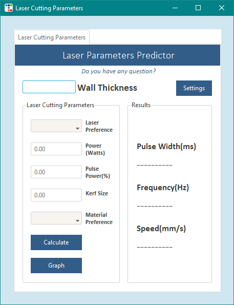
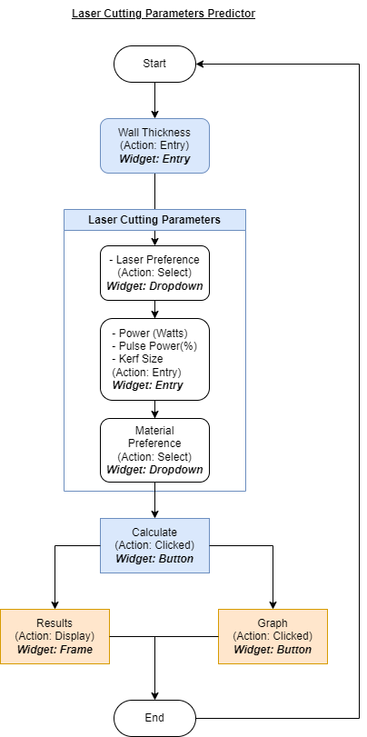
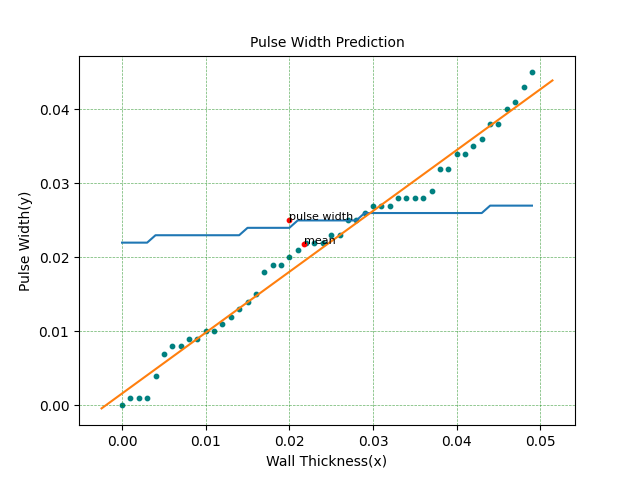
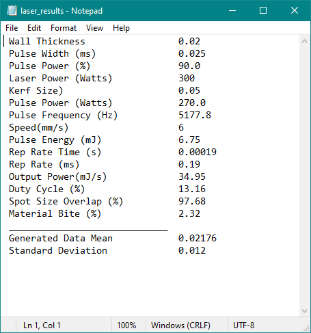
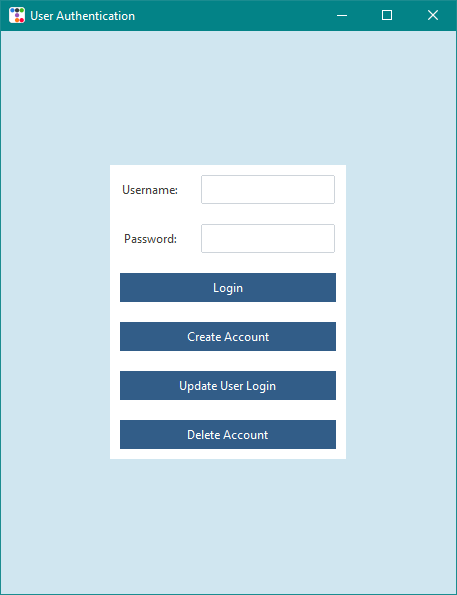

<html lang="en">
<head>
<meta charset="UTF-8">
<meta name="viewport" content="width=device-width, initial-scale=1.0">
<!-- Add your custom CSS styling here -->

</head>
<body>

<h1 align="center">
Nathan Kintu's ePortfolio
</h1>
<h2 align="center">
Self Assessment
</h2>

 
 Demonstrating a robust mastery of various software engineering principles and practices, I exhibit commendable skills in designing, developing, and maintaining intricate software systems. My expertise encompasses a solid grasp of data structures, algorithms, and object-oriented programming, translating into the creation of clean and efficient code bases.
Moreover, meticulous attention to detail characterizes my approach to code reviews, ensuring the enforcement of high-quality standards, best practices adherence, and adept problem-solving capabilities. Within team settings, my collaborative nature cultivates knowledge exchange and positively impacts project outcomes. A penchant for early issue identification and resolution streamlines development processes, elevating the overall quality of the product.
  
By consistently updating my skill set and remaining informed about industry advancements, I embody a growth-oriented mindset that propels me towards tackling fresh challenges and embracing opportunities for ongoing learning and growth. Proficient communication skills further enhance my value, facilitating seamless engagement in technical conversations and collaborative team efforts.
  
Reliable for delivering robust software solutions, adapting to evolving project demands, and making meaningful contributions to software engineering achievements, my commitment to continuous enhancement and strong foundational knowledge solidify me as a proficient and indispensable software engineer.
 

 
<h2 align="center">
Project: Laser cutting parameters predictor based on material thickness
</h2>

 My project focuses on Laser cutting software that leverages a precise cutting method commonly applied in industries for cutting and engraving materials with exceptional accuracy and speed. Operating through a focused laser beam to melt or burn through materials, it offers versatility in processing various materials and crafting intricate designs. The software outlined uses user-provided information to anticipate crucial cutting parameters, employing customized prediction models for different wall thicknesses. This approach optimizes the cutting process, enhancing efficiency and precision.

  

<h2 align="center">
Code Review
</h2>
<a href="https://youtu.be/M27asdylJRE" target="_blank"> Link to code review video </a>

 Code review in my project was crucial for peers to thoroughly examine code alterations, ensuring quality, consistency, and compliance with coding standards. I received feedback on utilizing simple and understandable variables and emphasizing comments to clarify code functionality. This collaborative review process aided in early bug detection, knowledge sharing among team members, and enhancing the overall codebase quality by advocating best practices..

 
<h2 align="center">
Software Design and Engineering
</h2>

 The project illustrates the core principles of software design and engineering through a rigorous process that focuses on conceptualization, planning, and development following established engineering methods. The primary goal is to create a top-tier software system known for its reliability and ease of maintenance.
  
Initial efforts concentrate on designing various elements of the software architecture, encompassing components, modules, interfaces, and data structures. This meticulous design phase guarantees that the software not only meets specific requirements but also is scalable, efficient, and adaptable for future modifications.
  
Furthermore, the project delves deeply into crafting an attractive and user-centered interface, highlighting the significance of user experience design. This involves not just improving the visual aspects of the interface but also comprehending user interactions to boost usability and overall satisfaction.
  
An integral part of the project involves implementing a secure database system to store user information. This database not only streamlines user management but also regulates access to the application, restricting usage to authorized individuals only.
Throughout the development process, the project incorporates best practices, coding standards, and stringent testing strategies to ensure the software's functionality, performance, and security. These measures play a vital role in upholding the software's robustness and dependability over time, signifying a holistic approach to software design and engineering within the project's scope.

<a href="https://github.com/nathankintuSNHU/Final-Project-Code-review/blob/main/Final_Project%20(Autheitication%20page%20combined%20with%20app%20Edited" target="_blank"> Link to Software Design and Engineering </a>

  

<h2 align="center">
Algorithms and Data Structures
</h2>

  

Having a deep understanding of data structures is essential for creating optimized algorithms and efficient code. In this project, my expertise in data structure management proves crucial for accurately foreseeing essential parameters in cutting metal sheets spanning from 0.006 to 0.06 inches in thickness.
  
When a user enters a wall thickness value and activates the “Calculate” button, the system springs into action. It creates a set of 50 random points stored in "model/modelData.txt", uniformly distributed within the designated thickness range. The meaning of these points is then calculated and juxtaposed with the input thickness to facilitate in-depth analysis.
  
Progressing from this initial phase, the system generates a second set of 50 points stored in "model/modelData2.txt", strategically devised based on the correlations between the initial data collections. These correlations are pivotal inputs for a predictive model housed in "model/material-models/pulsewidth-model1.txt," enabling the system to determine the optimal pulse width for laser cutting operations effectively.
  
By employing various equations and models, the system computes the speed, frequency, and additional values in the output.
  
The fusion of sophisticated data structure principles with predictive modeling culminates in the construction of a resilient system that significantly heightens the precision and efficiency of metal-cutting processes.

<a href="https://github.com/nathankintuSNHU/Final-Project-Code-review/blob/main/Data%20Structure%20and%20Algorithm" target="_blank"> Link to Algorithms and Data Structures code </a>

  
  

<h2 align="center">
Databases
</h2>

 A database is an organized data collection for easy access, management, and updates, acting as a central store ensuring data integrity, security, and consistency through tables, rows, and columns. The users interact via DBMS to query, add, modify, or delete data. Through prior courses, I grasp database importance, creating, reading, editing, and deleting data. In this project, I emphasize user control with an authentication page, granting access if user info matches database records. Utilizing SQLite, Python is employed to manage user storage and develop queries effectively. 

<a href="https://github.com/nathankintuSNHU/Final-Project-Code-review/blob/main/Authenticator" target="_blank"> Link to Database management code </a>

  

</body>
