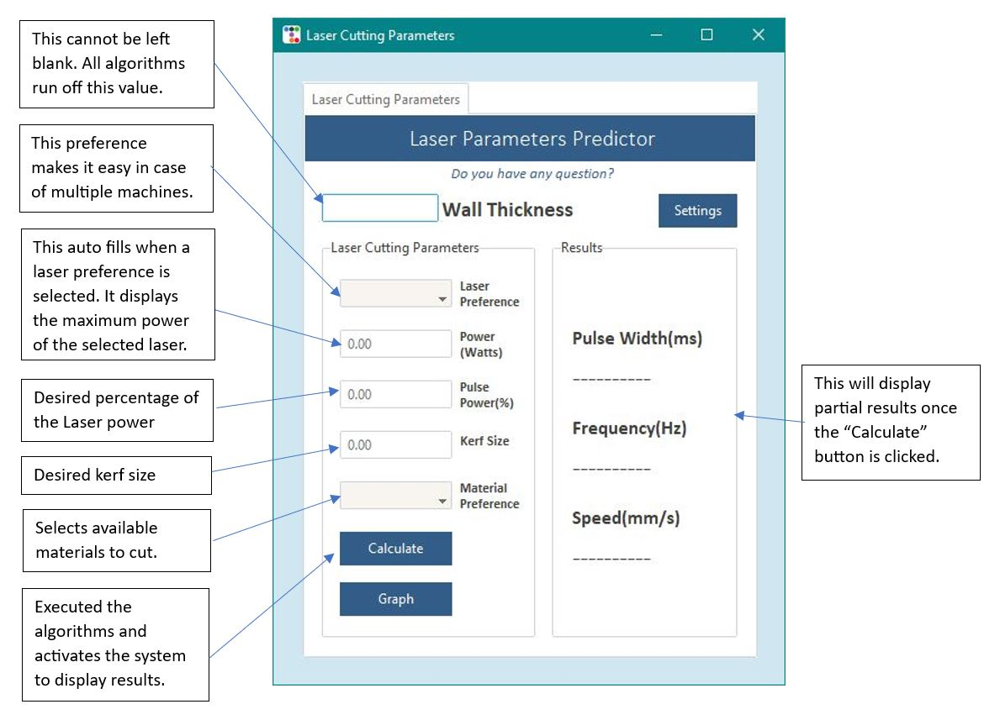

<h1 align="center">
Nathan Kintu's ePortfolio
</h1>

  

 Laser cutting is a precise method widely used across industries for cutting and engraving materials with high accuracy and speed. The technology employs a focused laser beam to melt or burn through materials, offering versatility in cutting various materials and creating intricate designs. The software discussed utilizes user-provided details to predict essential cutting parameters, processed through tailored prediction models for different wall thicknesses, streamlining the cutting process for efficiency and accuracy.

 
<h2 align="center">
Software Design and Engineering
</h2>

 The project illustrated the core principles of software design and engineering through a rigorous process that focused on conceptualization, planning, and development following established engineering methods. The primary goal was to create a top-tier software system known for its reliability and ease of maintenance.
  
Initial efforts concentrated on designing various elements of the software architecture, encompassing components, modules, interfaces, and data structures. This meticulous design phase guaranteed that the software would not only meet specific requirements but also be scalable, efficient, and adaptable for future modifications.
  
Furthermore, the project delved deeply into crafting an attractive and user-centered interface, highlighting the significance of user experience design. This involved not just improving the visual aspects of the interface but also comprehending user interactions to boost usability and overall satisfaction.
  
An integral part of the project involved implementing a secure database system to store user information. This database not only streamlined user management but also regulated access to the application, restricting usage to authorized individuals only.
  
Additionally, the project emphasized utilizing algorithms and data structures to effectively manage and process data. These algorithms were specifically applied to optimize laser parameter values, showcasing a practical application of computational tools within the software system.
  
Throughout the development process, the project incorporated best practices, coding standards, and stringent testing strategies to ensure the software's functionality, performance, and security. These measures played a vital role in upholding the software's robustness and dependability over time, signifying a holistic approach to software design and engineering within the project's scope.

<h2 align="center">
Algorithms and Data Structures
</h2>

Having a deep understanding of data structures is essential for creating optimized algorithms and efficient code. In this project, my expertise in data structure management proves crucial for accurately foreseeing essential parameters in cutting metal sheets spanning from 0.006 to 0.06 inches in thickness.
  
When a user enters a wall thickness value and activates the “Calculate” button, the system springs into action. It creates a set of 50 random points stored in "model/modelData.txt", uniformly distributed within the designated thickness range. The meaning of these points is then calculated and juxtaposed with the input thickness to facilitate in-depth analysis.
  
Progressing from this initial phase, the system generates a second set of 50 points stored in "model/modelData2.txt", strategically devised based on the correlations between the initial data collections. These correlations are pivotal inputs for a predictive model housed in "model/material-models/pulsewidth-model1.txt," enabling the system to determine the optimal pulse width for laser cutting operations effectively.
  
By employing various equations and models, the system computes the speed, frequency, and additional values in the output.
The fusion of sophisticated data structure principles with predictive modeling culminates in the construction of a resilient system that significantly heightens the precision and efficiency of metal-cutting processes.

<h2 align="center">
Databases
</h2>

 A database is an organized data collection for easy access, management, and updates, acting as a central store ensuring data integrity, security, and consistency through tables, rows, and columns. Users interact via DBMS to query, add, modify, or delete data. They vary from relational (SQL) to NoSQL and NewSQL types. Crucial in organizations, databases handle vast data and support various applications, from simple websites to complex systems. Through prior courses, I grasped database importance, creating, reading, editing, and deleting data. In this project, I am emphasizing user control with an authentication page, granting access if user info matches database records. Utilizing SQLite, Python was employed to manage user storage and develop queries effectively. 

