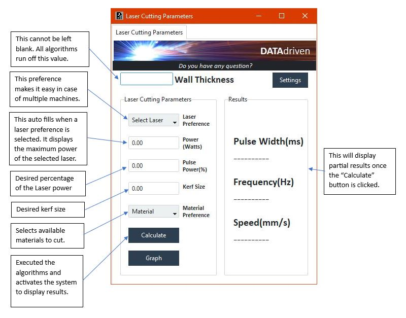

<h1 align="center">
Nathan Kintu's ePortfolio
</h1>

  

 Laser cutting is a precise method widely used across industries for cutting and engraving materials with high accuracy and speed. The technology employs a focused laser beam to melt or burn through materials, offering versatility in cutting various materials and creating intricate designs. The software discussed utilizes user-provided details to predict essential cutting parameters, processed through tailored prediction models for different wall thicknesses, streamlining the cutting process for efficiency and accuracy.

 
<h2 align="center">
Software Design and Engineering
</h2>

 The project illustrated the core principles of software design and engineering through a rigorous process that focused on conceptualization, planning, and development following established engineering methods. The primary goal was to create a top-tier software system known for its reliability and ease of maintenance.\n

Initial efforts concentrated on designing various elements of the software architecture, encompassing components, modules, interfaces, and data structures. This meticulous design phase guaranteed that the software would not only meet specific requirements but also be scalable, efficient, and adaptable for future modifications.

Furthermore, the project delved deeply into crafting an attractive and user-centered interface, highlighting the significance of user experience design. This involved not just improving the visual aspects of the interface but also comprehending user interactions to boost usability and overall satisfaction.

An integral part of the project involved implementing a secure database system to store user information. This database not only streamlined user management but also regulated access to the application, restricting usage to authorized individuals only.

Additionally, the project emphasized utilizing algorithms and data structures to effectively manage and process data. These algorithms were specifically applied to optimize laser parameter values, showcasing a practical application of computational tools within the software system.

Throughout the development process, the project incorporated best practices, coding standards, and stringent testing strategies to ensure the software's functionality, performance, and security. These measures played a vital role in upholding the software's robustness and dependability over time, signifying a holistic approach to software design and engineering within the project's scope.

<h2 align="center">
Algorithms and Data Structures
</h2>

In a prior academic course, I immersed myself in the complex world of data structures, the fundamental components of computer science that enable efficient data storage, organization, and manipulation. These serve as the bedrock for handling and processing data, facilitating smooth operations and accessibility. Arrays, linked lists, stacks, queues, trees, and graphs are among the common data structures, each with distinct features and applications designed to tackle specific computational hurdles.

Understanding data structures profoundly is crucial for designing efficient algorithms and developing high-performance code. In a practical project I engaged in, my expertise in managing data structures played a pivotal role in predicting crucial parameters for laser-cutting metal sheets with thicknesses varying from 0.006 inches to 0.06 inches.

The system I collaborated on exhibited a sophisticated workflow. Upon a user entering a specific value in the Wall thickness field, the system initiates by generating a random dataset containing 50 points evenly spread across the specified thickness range. The dataset's mean value is then calculated and juxtaposed with the input wall thickness, laying the groundwork for insightful analysis.

Subsequently, the system progresses by creating a second dataset of 50 points, guided by the previously discovered correlations between datasets. This correlation data acts as an essential input for a predictive model embedded within the system, ultimately leading to the computation and generation of the desired pulse width for laser-cutting tasks. This intricate fusion of data structure principles and predictive modeling results in a sturdy system capable of enhancing the efficiency and precision of metal-cutting operations.

<h2 align="center">
Databases
</h2>

 A database is an organized data collection for easy access, management, and updates, acting as a central store ensuring data integrity, security, and consistency through tables, rows, and columns. Users interact via DBMS to query, add, modify, or delete data. They vary from relational (SQL) to NoSQL and NewSQL types. Crucial in organizations, databases handle vast data and support various applications, from simple websites to complex systems. Through prior courses, I grasped database importance, creating, reading, editing, and deleting data. In this project, I am emphasizing user control with an authentication page, granting access if user info matches database records. Utilizing SQLite, Python was employed to manage user storage and develop queries effectively. 

